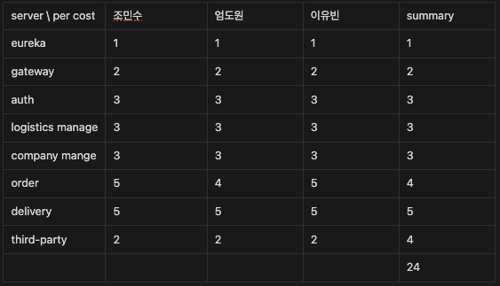
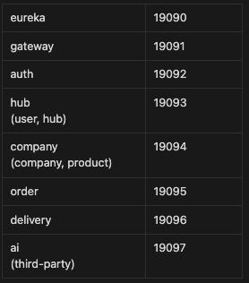
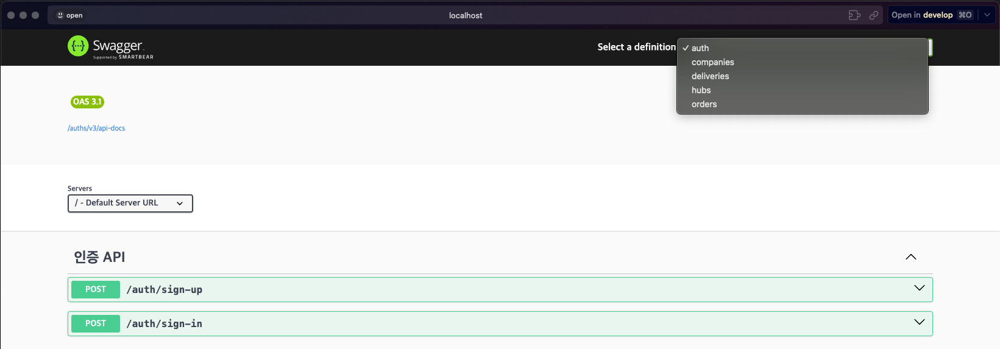
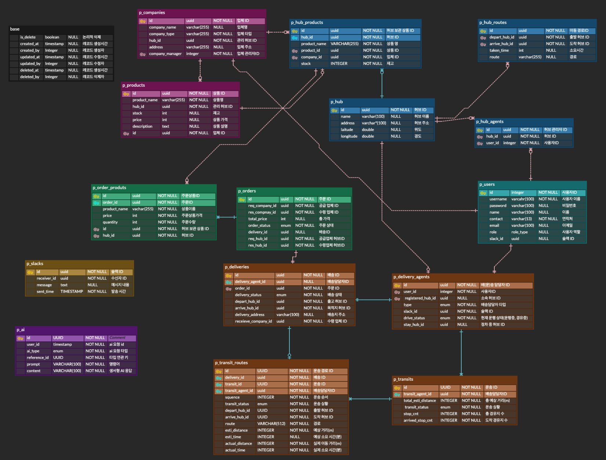

# two-ddang-logistics


---
## 프로젝트 목적 및 상세

지역 별 허브를 기반한 업체 간의 업체 배송, 허브 간 운송 등을 효율적으로 관리하고, 날씨, 운송 간 최적화 경로 등의 정보를 자동화 처리해 제공함으로 업무의 효율을 중점으로 설계되었습니다.

### 개발 스펙
| Development Spec | Version |
|------------------|---------|
| Java             | 17 LTS  |
| Springboot       | 3.3.3   |
| Swagger          | 3.1.x   |
| Docker-compose   | 3.8     |
| Redis            | 7.4     |

### Endpoint

| endpoint | uri                | description                            |
|----------|--------------------|----------------------------------------|
| auth     | /auth              | 로그인 및 회원가입                             |
| user     | /api/v1/users      | 권한 별 사용자 관리 API                        |
| hub      | /api/v1/hubs       | 허브 관리 (생성은 Master 권한만, 그 외 Hub 관리자 소관) |
| company  | /api/v1/companies  | 생산, 수령 업체 관리 API                       |
| product  | /api/v1/products   | 업체에서 생산하는 상품 관리 API                    |
| order    | /api/v1/orders     | 주문 생성 및 관리 API                         |
| transit  | /api/v1/transits   | 허브 간 운송 관리 API                         |
| delivery | /api/v1/deliveries | 허브 <-> 수려업체 간 배송 관리 API                |
| ai       | /api/v1/ais        | Gemini API 를 활용하는 API                  |


---
## 팀원 역할분담

### 개인/통합 공수 산출 결과


### 구성원 별 개발 담당 서버
- 조민수
    - delivery(5), logistics(3)
- 엄도원
    - order(4), company(3), eureka(1)
- 이유빈
    - third-party(3), gateway(2), auth(3)

---
## 서비스 구성 및 실행방법

### 서비스 구성


### 실행방법
**GOOGLE_APPLICATION_CREDENTIALS 세팅 필요**  
구글 클라우드 키파일 깃으로 관리가 불가한이슈로 인해  
zip 파일 안에 있는 'two-ddang-40b4e0dfa062.json' 파일의 절대경로를 잡아  
docker-compose.yml 안에있는 GOOGLE_APPLICATION_CREDENTIALS 에 넣어주셔야 합니다(파일명.확장자 까지)  
ex) GOOGLE_APPLICATION_CREDENTIALS=C:\two-ddang-40b4e0dfa062.json
  
  
root gradle project 경로에서 아래 명령어 실행
```shell
  docker-compose up --build -d
```
이 후 http://localhost:19091/ 접속,

상단의 definition 으로 api 호출 테스트

---
## erd diagram


